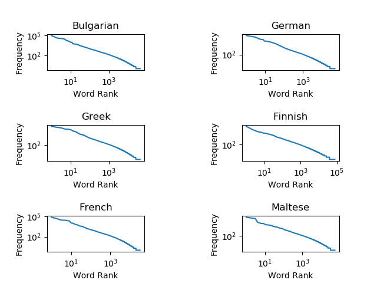
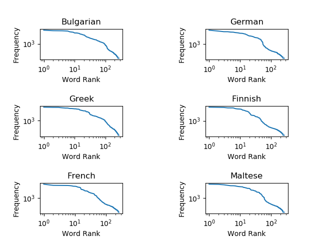

# Empirical verification of Zipf's Law using a multilingual corpora 

This repo contains code to implement an empirical verification of Zipf's law using a parallel multilingual corpus about EU legalisations in six different languages; German,
French, Greek, Bulgarian, Finnish, and Maltese.  

To run the code 

`python zipfs_law.py`

The program will produce the following plots 

**Word distribution Zipf's plots**

 

**Character distribution Zipf's plots** 

 

Zipf's Least Effort Principle reflected in word lengths and frequency 

**Average Word Lengths of Most Frequent Words vs Random Words**
 
| Bulgarian | German | Greek | Finnish | French | Maltese |
|-----------|--------|-------|---------|--------|---------|
| 1.6       | 3.0    | 2.7   | 4.5     | 2.1    | 3.1     |
| 12.4      | 13.2   | 10.0  | 13.6    | 10.3   | 7.8     |